# ENSF 619 - Group 8 - Ticket Reservation App
## Design Phase Report
### Submitted on: November 22, 2020
### Submitted by: Victor Tuah Kumi, Patrick Kwan, Oluwapelumi Laditan, Michael Lasby

# Use Case Diagram
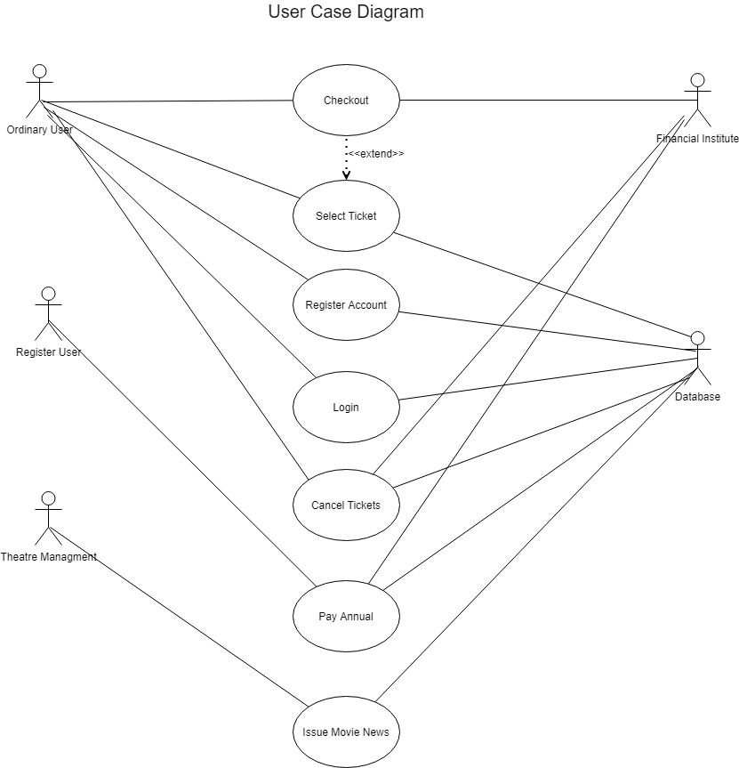

# Scenarios and Candidate Objects (see next Page)

# Conceptual Class Design Diagram
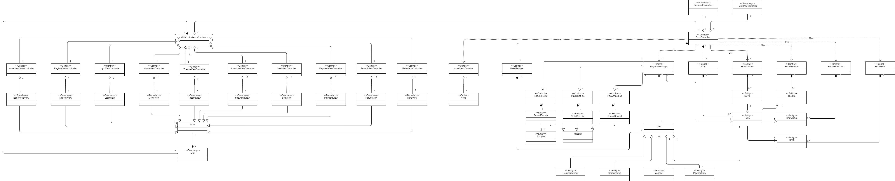

# Detailed Class Design Diagram
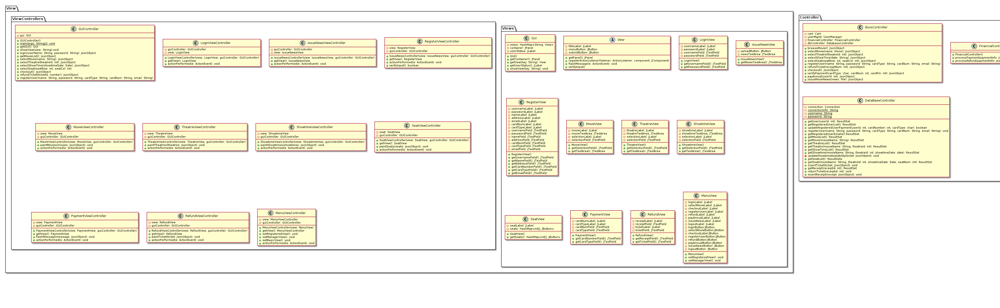

# Sequence Diagrams

## Use Case: Refund Ticket - By: Victor Tuah Kumi

## Use Case: Select Ticket - By: Patrick Kwan
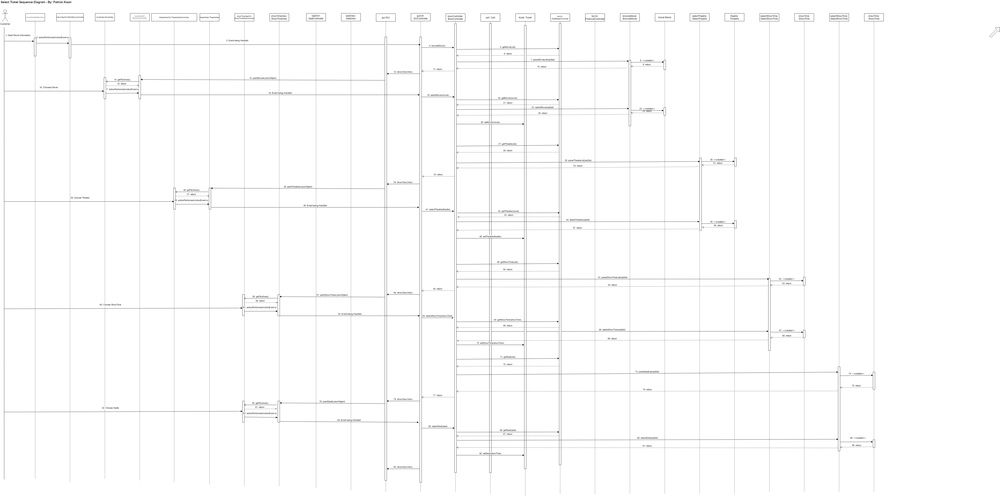

## Use Case: Checkout - By: Oluwapelumi Laditan
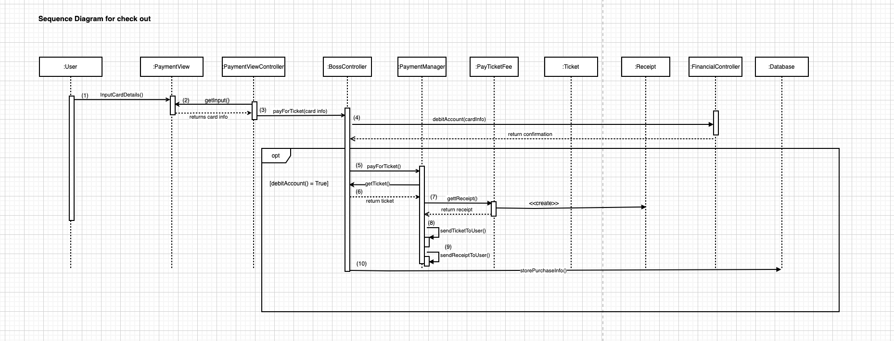

## Use Case: Register User - By: Michael Lasby
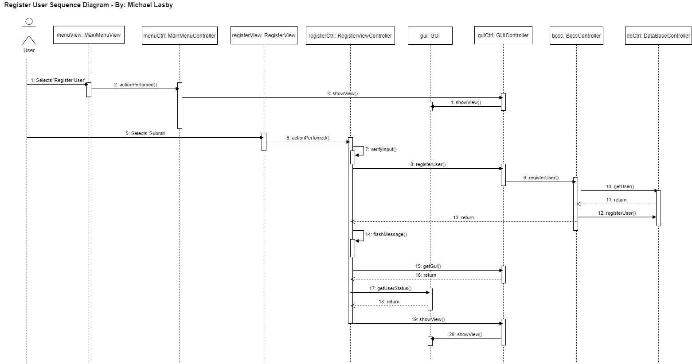

# State Transition Diagrams
## Ticket 
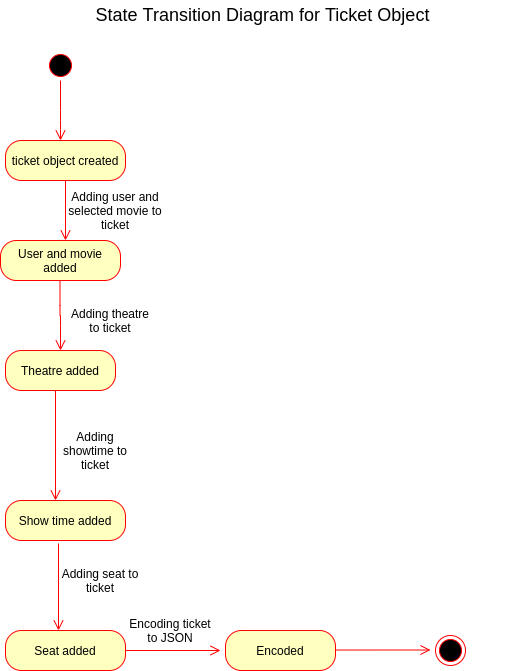

## Payment
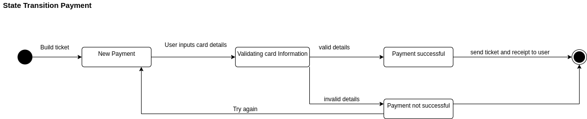

# Activity Diagrams

## Register Account
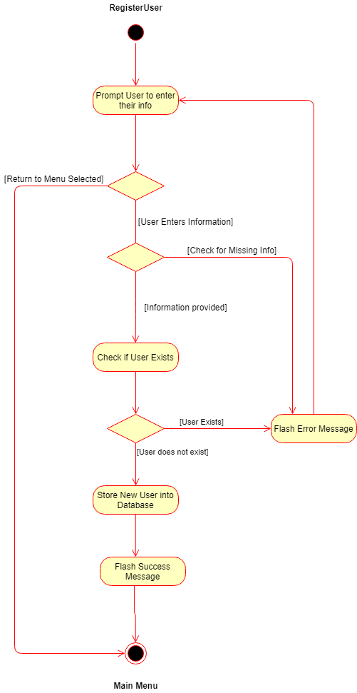

## Pay Annual
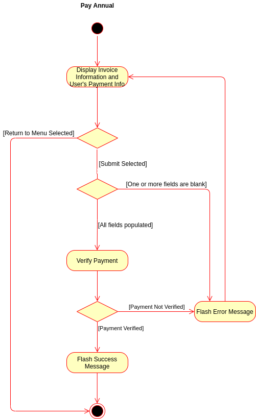

## Login
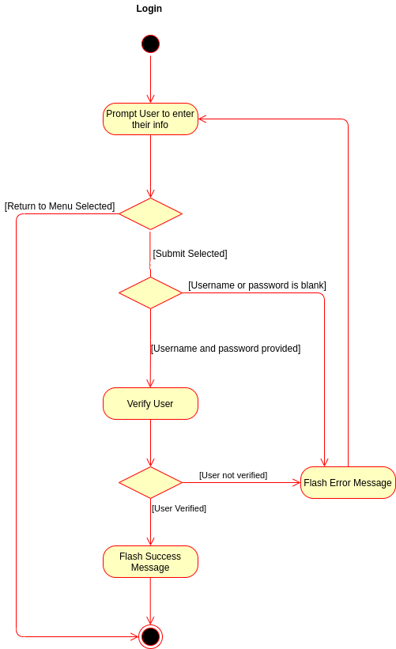

## Select Ticket

## Checkout
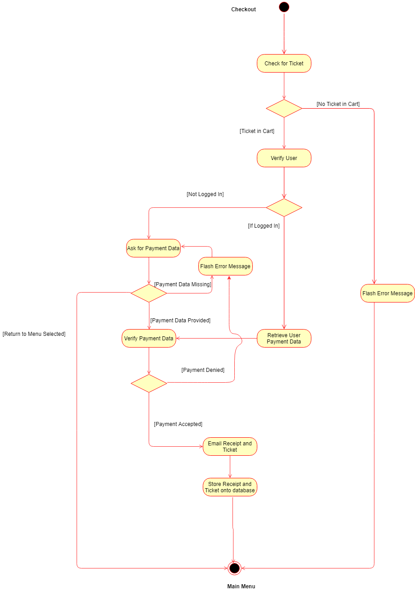

## Refund Ticket

## Issue Movie News

# Package Diagram
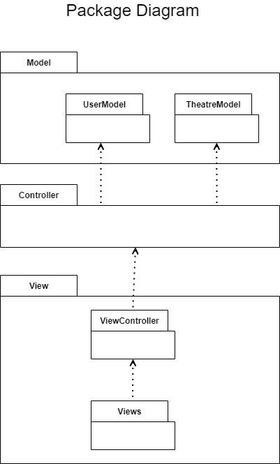

# Deployment Diagram

