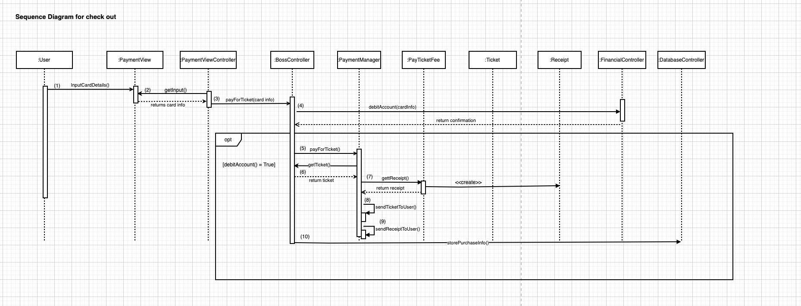
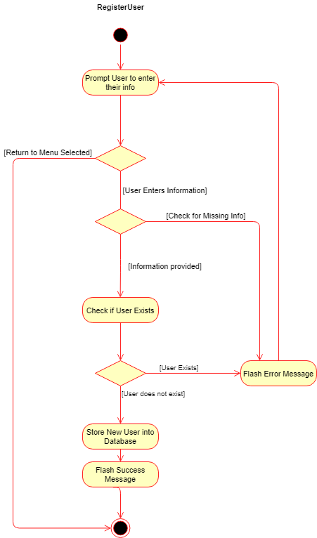
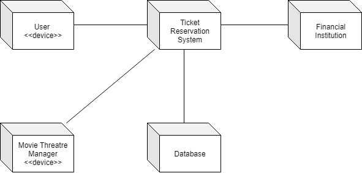

# ENSF 619 - Group 8 - Ticket Reservation App
## Design Phase Report
### Submitted on: November 22, 2020
### Submitted by: Victor Tuah Kumi, Patrick Kwan, Oluwapelumi Laditan, Michael Lasby

### README: 
Please note that some of these diagrams are best viewed as image / pdf files. These diagrams are included in the enclosed `./lib/` folder and file path names are included below. 

# Use Case Diagram
See `./lib/UseCaseDiagram/UseCaseDiagram.png`

# Scenarios and Candidate Objects (see next page)

# Conceptual Class Design Diagram (see next page)
See `./lib/ConceptualUML/ConceptualUML.png` or `/lib/ConceptualUML/ConceptualUML.pdf`

<!--  -->

# Detailed Class Design Diagram (see next 3 pages)
See `./lib/DetailedUML/DetailedUML.pdf`. `.png` files also available in the same folder. 

<!--  -->

# Sequence Diagrams (see next 4 pages)
## Use Case: Refund Ticket - By: Victor Tuah Kumi
See `./lib/SequenceDiagrams/KumiRefundTicketSequenceDiagram.pdf`

<!-- 

 -->

## Use Case: Select Ticket - By: Patrick Kwan
See `./lib/SequenceDiagrams/KwanSelectTicketSeqeunceDiagram.pdf`
<!-- 

 -->

## Use Case: Checkout - By: Oluwapelumi Laditan
See `./lib/SequenceDiagrams/LaditanCheckoutSequenceDiagram.pdf`

<!-- 

 -->

## Use Case: Register User - By: Michael Lasby
See `./lib/SequenceDiagrams/LasbyRegisterUserSequenceDiagram.pdf`

<!--  -->

# State Transition Diagrams
## Ticket 
See `./lib/StateTransition/TicketStateTransition.png`

## Payment
See `./lib/StateTransition/PaymentStateTransition.png`

# Activity Diagrams

## Register Account
See `./lib/ActivityDiagrams/RegisterUserActivityDiagram.png)`

## Pay Annual
See `./lib/ActivityDiagrams/RegisterUserActivityDiagram.png)`

## Login
See `./lib/ActivityDiagrams/LoginActivityDiagram.png)`

## Select Ticket
See `./lib/ActivityDiagrams/TicketSelectActivityDiagram.png)`

## Checkout
See `./lib/ActivityDiagrams/CheckoutActivityDiagram.png)`

## Refund Ticket
See `./lib/ActivityDiagrams/RefundTicketActivityDiagram.png)`

## Issue Movie News
See `./lib/ActivityDiagrams/IssueNewsActivityDiagram.png)`

# Package Diagram
See `./lib/PackageDiagram/PackageDiagram.png)`

# Deployment Diagram
See `./lib/PackageDiagram/DeploymentDiagram.png)`

