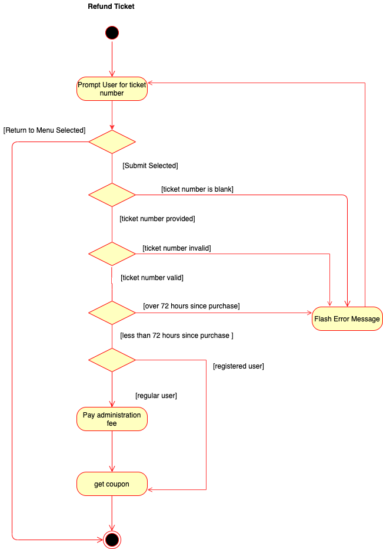

# ENSF 619 - Group 8 - Ticket Reservation App
## Design Phase Report
### Submitted on: November 22, 2020
### Submitted by: Victor Tuah Kumi, Patrick Kwan, Oluwapelumi Laditan, Michael Lasby

### README: 
Please note that some of these diagrams are best viewed as image / pdf files. These diagrams are included in the enclosed `./lib/` folder and file path names are included below. 

For page-break free viewing, we recommend viewing this report as a markdown file in your preferred markdown viewer. See `./ENSF-619_Group-8_TicketReservationApp-DesignReport.md`. 

# Use Case Diagram
See `./lib/UseCaseDiagram/UseCaseDiagram.png`

# Scenarios and Candidate Objects (see next page)

# Conceptual Class Design Diagram (see next page)
See `./lib/ConceptualUML/ClassUMLAttributesMethods.png`

# Detailed Class Design Diagram (see next page)
See `./lib/DetailedUML/DetailedClassDiagram.png`

# Sequence Diagrams (see next 4 pages)
## Use Case: Refund Ticket - By: Victor Tuah Kumi
See `./lib/SequenceDiagrams/SequenceRefundTicket.png`

<!-- 

 -->

## Use Case: Select Ticket - By: Patrick Kwan
See `./lib/SequenceDiagrams/SelectTicketRefundTicket.png`
<!-- 

 -->

## Use Case: Checkout - By: Oluwapelumi Laditan
See `./lib/SequenceDiagrams/SequenceCheckout.png`

<!-- 

 -->

## Use Case: Register User - By: Michael Lasby
See `./lib/SequenceDiagrams/SequenceRegisterUser.png`

<!--  -->

# State Transition Diagrams
## Ticket 
See `./lib/StateTransition/TicketStateTransition.png`

## Payment

# Activity Diagrams

## Register Account

## Pay Annual

## Login

## Select Ticket

## Checkout

## Refund Ticket

## Issue Movie News

# Package Diagram

# Deployment Diagram

